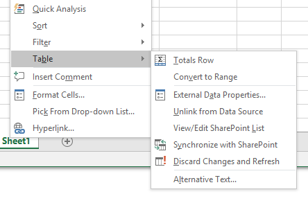

# Introduction

In **Microsoft Office Excel 2003**, you can connect to (read from) and update (write to) lists that reside on SharePoint sites. This allows you to keep the information in your Excel 2003 tables synchronized with the information that appears on the SharePoint site.

In **Microsoft Office Excel 2007, 2010, 2013 & 2016**, the ability to update the information in SharePoint lists from Excel is deprecated. Instead, Microsoft Office Access is the recommended platform for writing data to SharePoint lists and for using lists offline.

However, the **SharePoint List Synchronizer for Excel**, presented here, addresses this issue and allows Excel users to open SharePoint Lists in two-way sync.

