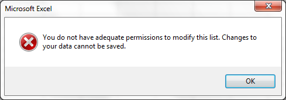
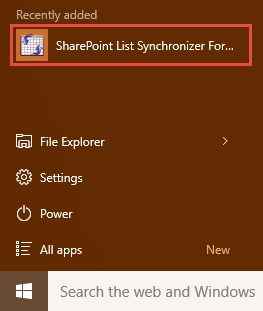
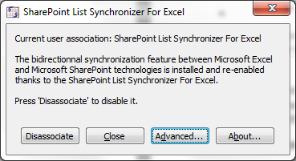
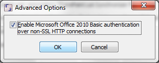

# Basic authentification over non-SSL HTTP connections

### Using Microsoft Excel 2010

By default, **Microsoft Excel 2010** doesn't prompt for user name and password when accessing basic authentication over non-SSL (HTTP instead of HTTPS) protected sites.

Therefore, when trying to access a list on one of those access protected sites results in the following error:

The SharePoint List Synchronizer for Excel supports such scenario thanks to its "**Basic authentication over non-SSL connections**" feature.

In a nutshell, activate this feature if:
* You’re using Microsoft Excel 2010,
* You’re using SharePoint Lists hosted on a site with basic authentication activated over non-SSL HTTP connections.

To activate the feature:
•	Launch "**SharePoint List Synchronizer For Excel - Configuration**" from the start menu

* Click on "**Advanced**"

* Then check "**Enable Microsoft Office Excel 2010 Basic authentication over non-SSL HTTP connections**", click "**OK**" and close the application.

*Note: To disable the feature, repeat the same steps and uncheck it.*

By activating this feature through our tool, Excel will now prompt users for their credentials and pass them to the site. This way, Excel 2010 users will be able to open SharePoint Lists from access protected sites in two-way sync over again.

### Using Microsoft Excel 2013 and higher

With Microsoft Excel 2013 or higher, for security reasons, you must use SSL if you use basic authentication.

**Important note**: Even if you uninstall Microsoft Excel 2013 and revert to previous versions, you won't be able to use basic authentication without SSL.

