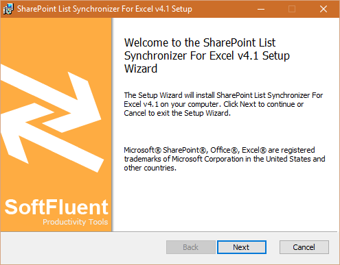
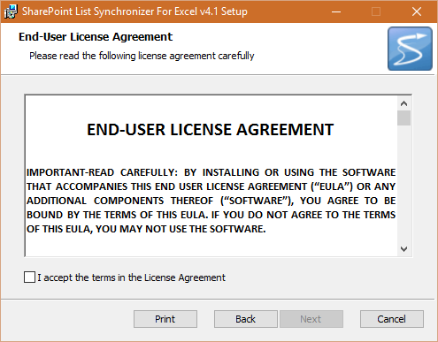
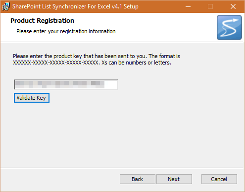
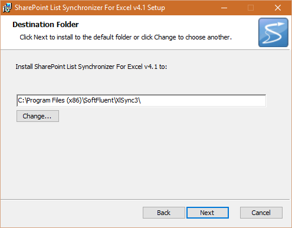
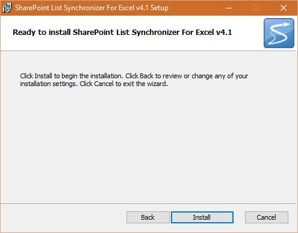
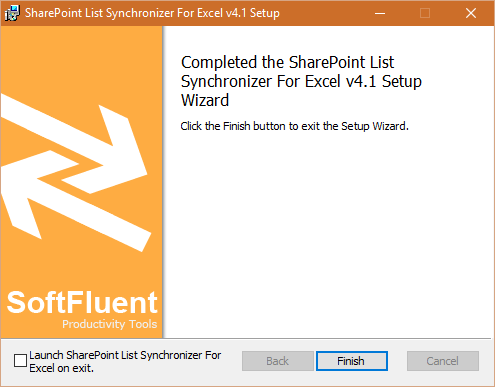

# Installation

## Visual Installation

* Download the installer: [http://www.softfluent.com/product/sharePoint-list-synchronizer/](http://www.softfluent.com/product/sharePoint-list-synchronizer/)
* Launch the installer "**XlSyncSetup.msi**":

* Click "**Next**", then read and check "**I accept the terms in the License Agreement**", and hit "**Next**" again

* Type-in your license key, click on "**Validate Key**", and "**Next**"

* Select your destination folder

* Click "**Install**" to install the application on your machine

* The application will be deployed to the destination folder, and upon completion the following form will show up:

## Silent Installation

To install the tool silently you can use the following command line:

`$>msiexec /i XlSyncSetup.msi /qn XLSYNC_KEY=<provided key>`

**Note**: Don't forget to replace the `<provided key>` tag by your actual key.

