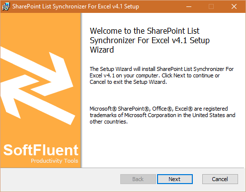
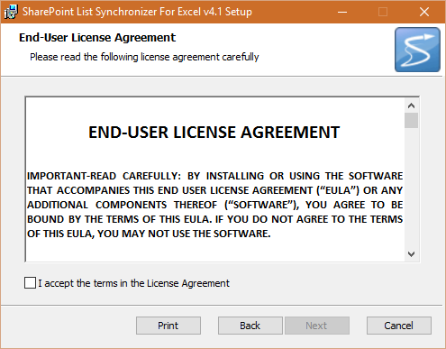
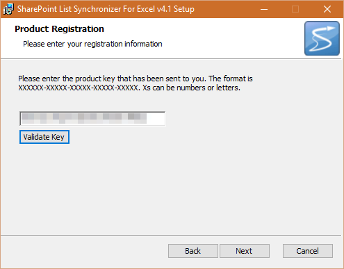
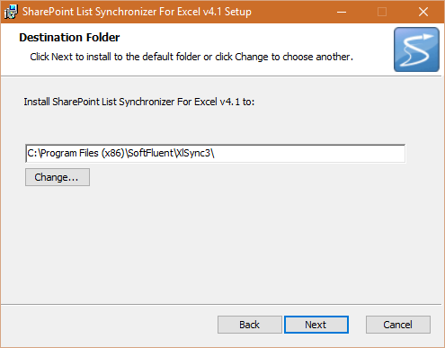
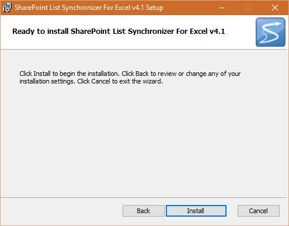

# Installation

## Visual Installation

* Download the installer: [http://www.softfluent.com/product/sharePoint-list-synchronizer/](http://www.softfluent.com/product/sharePoint-list-synchronizer/)
* Launch the installer "**XlSyncSetup.msi**":

* Click "**Next**", then read and check "**I accept the terms in the License Agreement**", and hit "**Next**" again

* Type-in your license key, click on "**Validate Key**", and "**Next**"

* Select your destination folder

* Click "**Install**" to install the application on your machine

