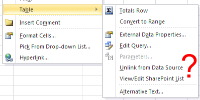

# Overview

In Office Excel 2007, 2010, 2013 & 2016, the ability to update SharePoint lists changed in the following ways:
* Opening a list from SharePoint with Excel 2007, 2010, 2013 or 2016 disables the "Synchronize with SharePoint" feature.
* Existing .XLS files from Office Excel 2003 still load and continue to support update functionality when opened in Excel 2007, 2010, 2013 or 2016.
* Lists that link to a SharePoint site are converted to read-only tables when you save existing files to the new Open XML Excel 2007, 2010, 2013 or 2016 file formats.

Meanwhile, Microsoft published an add-in which allows users to publish new read-write lists in SharePoint (Excel 2007 Add-in: Synchronizing Tables with SharePoint Lists). While this add-in works great to publish new Excel tables to SharePoint, it doesn’t address the issue of lists exported from SharePoint. For example, every time you export your SharePoint list to Excel 2007, 2010, 2013 & 2016; all changes applied in Excel cannot be synchronized back with the original list anymore, instead you need to apply those changes manually or use Microsoft Office Access. The “Synchronize with SharePoint” menu has disappeared:

Well, thanks to the **SharePoint List Synchronizer for Excel**, this scenario is now possible in Excel again: you can export your list to Excel 2007, 2010, 2013 & 2016 and synchronize back to SharePoint without any extra-effort!