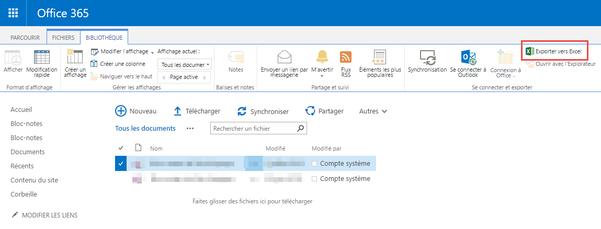
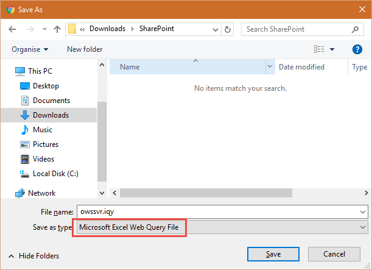
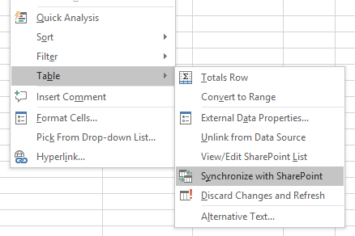

# Scenario

* With the tool installed, go to your favorite SharePoint site and go to a SharePoint List.
* Click on "**Export to Excel**".

* Click on "**Save**", and Excel will open the list however this time with the "**Synchronize with SharePoint**" option activated!

*Note: In order to retain the functionality for this table across saves, you need to save the workbook in the Excel 2003 .XLS file format.*